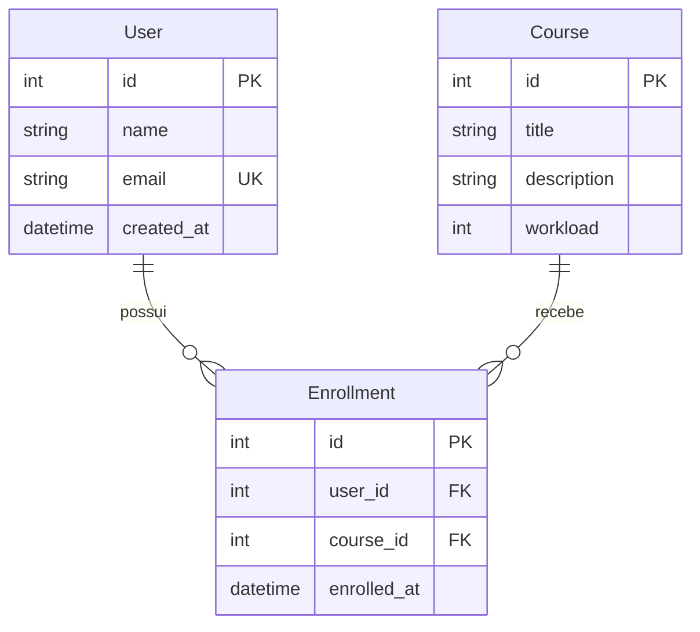

# StudyManager API

Atividade avaliativa da disciplina de Desenvolvimento API Back-end — UniEVANGÉLICA.

O projeto consiste em uma API RESTful para gerenciamento de usuários, cursos e matrículas. Foram utilizados FastAPI, SQLAlchemy e SQLite, com separação de camadas e respostas JSON padronizadas.

## Executar

Requisito: Python 3.12 ou superior. Execute na raiz do projeto, usando PowerShell:

```powershell
python -m venv .venv
.\.venv\Scripts\python.exe -m pip install -r requirements-lock.txt
.\.venv\Scripts\python.exe -m uvicorn app.main:app --reload
```

No Linux/macOS, use `python3 -m venv .venv` e substitua `.\.venv\Scripts\python.exe` por `.venv/bin/python`.

- Swagger interativo: http://127.0.0.1:8000/docs
- ReDoc: http://127.0.0.1:8000/redoc
- OpenAPI: http://127.0.0.1:8000/openapi.json

O arquivo `studymanager.db` e suas tabelas são criados automaticamente na inicialização. Para outro arquivo SQLite, configure `$env:DATABASE_URL = "sqlite:///./outro.db"` antes de iniciar. O projeto usa `create_all` para o banco inicial; alterações futuras de esquema exigem migrações (por exemplo, Alembic). Não há autenticação, conforme o escopo da atividade.

## Estrutura e justificativa

```text
app/
├── main.py                    # Composição, configuração e ciclo de vida
├── api/
│   ├── routes.py              # Controllers HTTP
│   ├── schemas.py             # Validação de entrada e contratos JSON
│   ├── errors.py              # Tradução de exceções para HTTP
│   └── dependencies.py        # Injeção dos serviços/repositórios
├── domain/
│   ├── entities.py            # Entidades Python independentes
│   ├── repositories.py        # Contratos de persistência (Protocols)
│   └── errors.py              # Exceções da aplicação
├── services/
│   └── study_manager.py       # Casos de uso e regras de negócio
└── infrastructure/
    ├── database.py            # Engine e integridade referencial SQLite
    ├── models.py              # Mapeamento e relacionamentos ORM
    └── repositories.py        # Implementações SQLAlchemy dos contratos
tests/
└── test_api.py                # Testes de integração HTTP/banco
```

A organização aplica os conceitos de Arquitetura Limpa ao manter entidades e contratos de repositório no domínio, sem dependências de FastAPI ou SQLAlchemy. Os serviços dependem desses contratos e concentram os casos de uso, enquanto os controllers apenas recebem dados validados, chamam serviços e retornam respostas. A infraestrutura implementa a persistência e converte os modelos ORM em entidades, e a composição injeta essas implementações nos serviços. Essa direção de dependências permite trocar detalhes de banco ou HTTP sem modificar as regras de negócio, favorecendo testes, nomes claros e responsabilidades pequenas.

## Modelagem



O par `(user_id, course_id)` é único. As chaves estrangeiras são habilitadas no SQLite. A consulta relacional usa `relationship`, `back_populates` e `selectinload` para carregar matrículas e cursos pelo ORM. Excluir usuário ou curso remove suas matrículas em cascata, preservando a outra entidade. Datas são retornadas em UTC.

## Endpoints

| Método | Rota | Sucesso | Operação |
|---|---|---|---|
| POST | `/users` | 201 | Criar usuário |
| GET | `/users` | 200 | Listar usuários |
| GET | `/users/{id}` | 200 | Consultar usuário |
| PUT | `/users/{id}` | 200 | Substituir nome e email |
| DELETE | `/users/{id}` | 200 | Excluir usuário e suas matrículas |
| POST | `/courses` | 201 | Criar curso |
| GET | `/courses` | 200 | Listar cursos |
| GET | `/courses/{id}` | 200 | Consultar curso |
| PUT | `/courses/{id}` | 200 | Substituir dados do curso |
| DELETE | `/courses/{id}` | 200 | Excluir curso e suas matrículas |
| POST | `/enrollments` | 201 | Matricular usuário em curso |
| GET | `/users/{id}/courses` | 200 | Consultar usuário e cursos |

Listagens aceitam `offset` (padrão 0) e `limit` (padrão 100, máximo 100), ordenadas por ID. `PUT` exige todos os campos editáveis. `DELETE` retorna 200 porque inclui um corpo JSON de confirmação.

## Validações e erros

- Nome: 1–120 caracteres; título: 1–200; descrição: 1–5000; espaços nas extremidades são removidos.
- Email válido e único, normalizado para minúsculas; limite de 254 caracteres.
- Carga horária: inteiro positivo, sem aceitar booleanos ou números fracionários.
- IDs positivos; campos extras não são aceitos.
- Usuário/curso inexistente: **404**; email/matrícula duplicado: **409**; dados inválidos: **422**.
- Erros inesperados: **500**, com detalhes apenas no log do servidor.
- Restrições no banco também protegem contra duplicidade em requisições concorrentes; falhas de integridade fazem rollback e retornam **409**.

Respostas de sucesso seguem `{"success": true, "message": "...", "data": ...}`. Erros seguem:

```json
{
  "success": false,
  "message": "User not found",
  "data": null
}
```

## Exemplo completo (PowerShell)

```powershell
$base = "http://127.0.0.1:8000"
$user = Invoke-RestMethod "$base/users" -Method Post -ContentType "application/json" -Body '{"name":"Ana","email":"ana@example.com"}'
$course = Invoke-RestMethod "$base/courses" -Method Post -ContentType "application/json" -Body '{"title":"Python","description":"APIs com FastAPI","workload":40}'
$body = @{ user_id = $user.data.id; course_id = $course.data.id } | ConvertTo-Json
Invoke-RestMethod "$base/enrollments" -Method Post -ContentType "application/json" -Body $body
Invoke-RestMethod "$base/users/$($user.data.id)/courses" | ConvertTo-Json -Depth 6
```

A consulta retorna `data.user` com os dados do usuário e `data.courses` com seus cursos (lista vazia quando não há matrículas).

## Testes

### Testes automatizados

```powershell
.\.venv\Scripts\python.exe -m pytest -q
```

Os testes usam SQLite em memória isolado por teste, sem alterar o banco local. Cobrem CRUD, unicidade, validações, recursos inexistentes, relacionamento, cascata, constraints do banco, paginação, erros HTTP, proteção de detalhes internos e OpenAPI.

### Teste manual pelo Swagger

Com o servidor em execução, abra `http://127.0.0.1:8000/docs`. Para enviar uma requisição, expanda o endpoint, clique em **Try it out**, preencha os dados e clique em **Execute**.

1. Cadastre um usuário em `POST /users`:

```json
{"name": "Ana", "email": "ana@example.com"}
```

2. Cadastre um curso em `POST /courses`:

```json
{"title": "Python", "description": "APIs com FastAPI", "workload": 40}
```

3. Anote os IDs retornados e use-os em `POST /enrollments`. Exemplo para IDs iguais a 1:

```json
{"user_id": 1, "course_id": 1}
```

4. Consulte `GET /users/{id}/courses` com o ID do usuário. A resposta deve conter o usuário e o curso cadastrado.
5. Repita a matrícula: a API deve retornar **409**. Envie uma carga horária igual a zero: deve retornar **422**. Consulte um ID inexistente: deve retornar **404**.
6. Use `PUT /users/{id}` e `PUT /courses/{id}` para atualizar os dados, enviando todos os campos editáveis. Confira as alterações com `GET`.
7. Exclua o curso com `DELETE /courses/{id}` e consulte novamente os cursos do usuário: a lista deve estar vazia. Exclua o usuário e confira que a consulta retorna **404**.

Os dados do teste manual permanecem no arquivo SQLite entre execuções. Em novos testes, use outro email ou exclua os registros anteriores. Para encerrar o servidor, pressione `Ctrl+C` no terminal.

## Repositório

[DESENVOLVIMENTO-API-BACK-END](https://github.com/Garibas74/DESENVOLVIMENTO-API-BACK-END)

## Referências

- [FastAPI: tratamento de erros](https://fastapi.tiangolo.com/tutorial/handling-errors/)
- [FastAPI: lifespan](https://fastapi.tiangolo.com/advanced/events/)
- [SQLAlchemy: relacionamentos ORM](https://docs.sqlalchemy.org/en/20/orm/relationships.html)
- Robert C. Martin, *Clean Code*: referência conceitual para nomes, funções pequenas e separação de responsabilidades.
